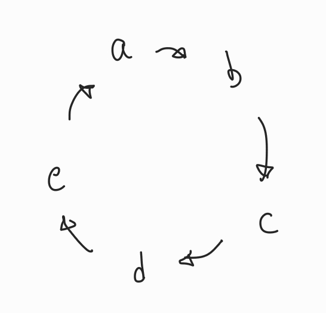
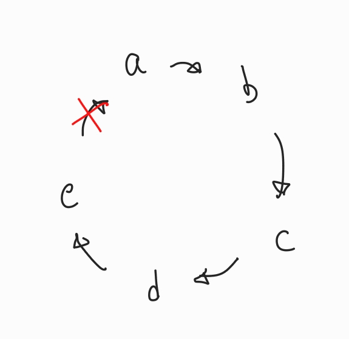
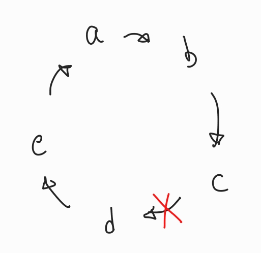

## 접근 방법
방문하고자 하는 모든 지점은 아래와 같이 원형으로 이어져 있다.  
  

이때 두 지점을 잇는 길목 중 하나의 길목을 제거해보면,
  
와 같이 여전히 모든 지점을 방문할 수 있다.  

아래와 같이 위에서 제거한 길목이 아닌 다른 길목을 제거해봐도,
  
와 같이 여전히 모든 지점을 방문할 수 있다.  

즉, 주어진 길목 중 하나의 길목만을 제거한다면 길목을 제거해도 여전히 모든 지점을 방문할 수 있다.  
따라서 가장 비용이 비싼 길목을 제거하면 된다.  

## 구현
```c
#include <stdio.h>

#define MAX(x, y) ((x) > (y) ? (x) : (y))

int main(void) {
    size_t n = 0;
    scanf("%zu", &n);

    size_t sum = 0;
    size_t max = 0;

    for (size_t i = 0; i < n; i++) {
        size_t temp = 0;
        scanf("%zu", &temp);

        sum += temp;
        max = MAX(max, temp);
    }

    printf("%zu\n", sum - max);

    return 0;
}
```

어떤 길목을 제거하는 것은 그 길목의 비용을 빼는 것과 같다.  
따라서 모든 길목에 대한 정보를 받으며 그 합과 최댓값을 구해 전체 비용의 합에서 최대 비용을 빼주면 된다.  

## 외부 링크
[욱제는 효도쟁이야!! | BOJ](https://www.acmicpc.net/problem/14487)  
[채점 결과 | BOJ](http://boj.kr/f7b6c584a5fd4d60a06bb0fc4707d411)  

