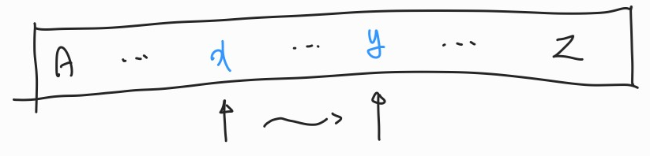
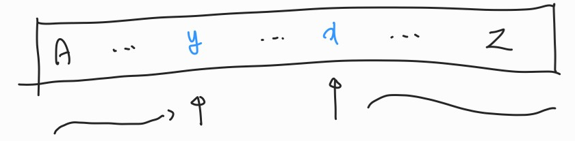
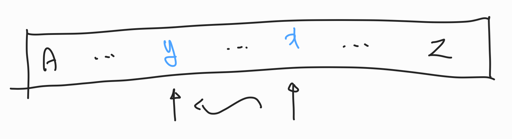
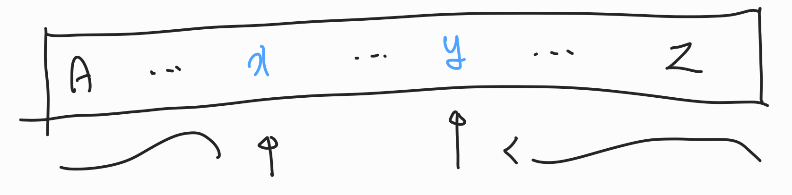

## 접근 방법
어떤 문자 $x$에서 다음 문자 $y$로 가는 방법은 두 가지가 있다.  
알파벳 순서대로 탐색하는 방법(이하 정방향)과 알파벳 순서의 반대 방향으로 탐색하는 방법(이하 역방향)이 있다.  

정방향으로 탐색하는 방법은 아래 두 방법이 있다.  

첫째, 탐색을 시작하는 문자가 탐색 대상 문자보다 앞서는 경우,
  

둘째, 탐색을 시작하는 문자가 탐색 대상 문자보다 뒤쳐진 경우,
  

두 번째는 탐색을 진행하면서 `Z` -> `A`로 한 바퀴 돌아서 탐색하는 것을 볼 수 있다.  

역방향으로 탐색하는 방법은 아래 두 방법이 있다.  

첫째, 탐색을 시작하는 문자가 탐색 대상 문자보다 뒤쳐진 경우,
  

둘째, 탐색을 시작하는 문자가 탐색 대상 문자보다 앞서는 경우,
  

이번에도 두 번째는 탐색을 진행하면서 `A` -> `Z`로 한 바퀴 돌아서 탐색하는 것을 볼 수 있다.  

이때 네 가지 경우 중 회전판을 움직이는 횟수가 가장 작은 쪽을 택해 탐색을 진행하면 된다.  

## 구현
```c
#include <stdio.h>

#define MIN(x, y) ((x) < (y) ? (x) : (y))

int main(void) {
    char phrase[101] = "";
    scanf("%s", phrase);

    char* cursor = phrase;
    char curr = 'A';

    size_t answer = 0;
    while (*cursor != '\0') {
        size_t left = (curr + 26 * (curr < *cursor)) - *cursor;
        size_t right = (*cursor + 26 * (*cursor < curr)) - curr;

        answer += MIN(left, right);
        curr = *cursor;
        cursor++;
    }

    printf("%zu\n", answer);

    return 0;
}
```

시작 문자를 `A`로 지정하여 탐색을 시작한다.  

주어진 문자열을 첫 문자부터 탐색하며 상술한 네 가지 경우 중 가장 적게 움직이는 쪽을 채택한다.  

정방향으로 탐색하는 경우, 시작 문자가 탐색 문자보다 앞서는 때는 `*cursor - curr`로 회전판이 움직이는 횟수를 구할 수 있다.  
그런데 시작 문자가 탐색 문자보다 뒤쳐지는 경우가 있을 수 있으므로 그 때에는 `*cursor`에 `26`을 더해 `*cursor`가 `curr`보다 항상 더 크도록 해준다.  

역방향으로 탐색하는 경우, 시작 문자가 탐색 문자보다 뒤쳐지는 때는 `curr - *cursor`로 회전판이 움직이는 횟수를 구할 수 있다.  
그런데 시작 문자가 탐색 문자보다 앞서는 경우가 있을 수 있으므로 그 때에는 `curr`에 `26`을 더해 `curr`가 `*cursor`보다 항상 더 크도록 해준다.  

이렇게 구한 회전판이 움직이는 횟수 중 더 작은 쪽을 택하여 더해주면 된다.  

이후 `curr`를 `*cursor`로 바꾸어 회전판이 돌아갔음을 저정한다.  
문자열의 모든 문자에 대해 이 과정을 반복하면 된다.  

## 외부 링크
[ZOAC 2 | BOJ](https://www.acmicpc.net/problem/18238)  
[채점 결과 | BOJ](http://boj.kr/73828416ed224246836bdc2fd51141ef)  
