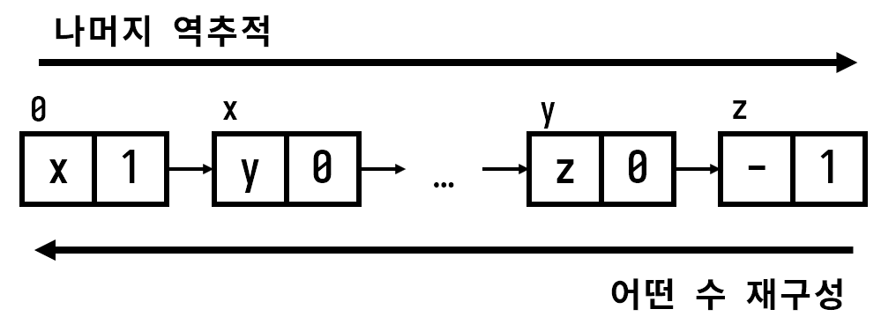

## 접근 방법
### 나이브한 접근 (ft. 낙천주의)
가장 나이브하게 생각해볼 수 있는 해결책은 숫자 $1$로부터 시작하여 $10$, $11$, $100$, $101$, $110$, $111$, ...을 전부 탐색하는 것이다.  
이때 수가 $0$으로 시작하면 안 된다는 조건이 있으므로 $1$부터 시작해도 가능한 모든 수를 탐색할 수 있다.  

이를 실제로 구현한다면 아래과 같은 코드를 작성할 수 있다.  
```python
def solve(n):
    q = deque()
    q.append(1)

    while q:
        i = q.popleft()

        if i % n == 0:
            return i

        q.append(i * 10)
        q.append(i * 10 + 1)

    return None
```

우선 DFS대신 BFS를 사용한 것은 $1$뒤에 $0$ 또는 $1$만을 계속해서 붙여 $10000000...$ 등이 되어 무한 루프에 빠지지 않기 위함이다.  
그런데 위 코드에는 몇 가지 문제점이 있다.  

첫째로는 언제 끝날지 모르는 루프를 계속해서 돌고 있다는 것이다.  
물론 언젠가 $n$으로 나누면 $0$이 되는 수를 만날 수 있겠으나 사실상 무한한 경우의 수가 존재하는데 이를 기대하는 것은 너무 낙천적인 관점이다.  

둘째로는 탐색할 수 자체가 너무나도 커질 수 있음이다. C의 정수형처럼 최대 크기가 $2^{64}$ 정도가 고작인 언어에서 자릿수가 $100$인 수는 너무 크다.  
파이썬처럼 큰 수 연산을 지원하는 언어에서도 이를 다루는 것은 비교적 비싼 연산이므로 그리 좋은 선택은 아니다.  

### 우리가 관심있는 것은 나머지
그렇다면 적절하게 BFS를 적용하기 위해 탐색할 대상을 줄여야 한다.  
가령 원래 우리가 탐색하려던 대상은 $1$, $10$, $11$, $100$, $101$, $110$, $111$, ... 등이었다.  

그렇다면 이 탐색 대상을 어떻게 줄일 수 있을까?  
한 가지 단서가 있다면 우리가 구하고자 하는 수는 $n$으로 나누어 떨어지는 수라는 것이다.  
그렇다면 우리는 *어떤 수*를 탐색하는 것이 아니라 어떤 수를 *나눈 나머지*를 탐색해볼 수 있다.  

이렇게 하면 탐색 대상을 사실상 무한 개에서 $n$개로 축소할 수 있다.  
(나머지가 $0$인 수, 나머지가 $1$인 수, ... 나머지가 $n - 1$인 수)

또한 어떤 수를 탐색 대상으로 보는 대신 그 수를 나눈 나머지를 탐색 대상으로 보면 나머지가 동일한 두 수가 나왔을 때 탐색을 중단할 수 있다.  
(`visited` 배열 등을 유지할 수 있다.)

#### Funny Modulo Business
*어떤 수*를 탐색하는 대신 그 나머지를 탐색하는 아이디어는 좋으나 어떤 수를 나눈 나머지가 같다고 해서 탐색을 중단하는 것이 과연 올바른 방법일지 고민해보자.  

보통 BFS에서 `visited`과 같은 방문 배열을 유지하는 이유는 더 이상 그 지점에서의 탐색이 무의미함을 표시하기 위함이다.  

예를 들어 어떤 그리드에서 최소 움직임을 계산할 때 현재 위치에서의 걸음 수가 $10$이라고 하자.  
그런데 이전에 방문했던 기록이 방문 배열에 있어 $5$라는 값이 있다면 어느 방향으로 가든 현재 시점에서 이전 시점의 $5$걸음을 따라잡을 수는 없다.  
따라서 즉시 탐색을 종료해도 좋다.  

이와 비슷하게 현재 탐색 중인 수와 나머지가 동일한 이전에 탐색한 어떤 수를 $x$라 하고 현재 탐색 중인 수를 $y$라고 하자.  
만약 $x$의 다음 수 $p$, $q$의 나머지가 각각 $i$, $j$이고 $y$의 다음 수 $r$, $s$의 나머지도 각각 $i$, $j$가 된다면 앞서 살펴본 그리드에서의 최소 움직임처럼 이미 $x$를 탐색할 때 $y$와 동일한 상황을 탐색한 것이 되므로 더 이상 탐색을 진행할 이유가 없다.  

이가 성립함은 모듈러 연산의 속성을 통해 보일 수 있다.  
아까와 동일하게 현재 탐색 중인 수와 나머지가 동일한 이전에 탐색한 어떤 수를 $x$라 하고 현재 탐색 중인 수를 $y$라고 하자.  
또, $x$의 다음 수 $p$, $q$의 나머지가 각각 $i$, $j$이고 $y$의 다음 수 $r$, $s$의 나머지를 각각 $k$, $l$이라고 하자.  

$x$와 $y$의 다음 수는 수 뒤에 $0$ 또는 $1$을 붙이는 것이므로,
$$
\begin{align*}
p &= 10x \newline
q &= 10x + 1 \newline
\newline
r &= 10y \newline
s &= 10y + 1 \newline
\end{align*}
$$
로 정의할 수 있다.  

이때 $i$와 $k$를 살펴보면,
$$
\begin{align*}
i &= 10x\ mod\ n \newline
  &= 10 \cdot x\ mod\ n \newline
  &= (10\ mod\ n) \cdot (x\ mod\ n)
\end{align*}
$$

$$
\begin{align*}
k &= 10y\ mod\ n \newline
  &= 10 \cdot y\ mod\ n \newline
  &= (10\ mod\ n) \cdot (y\ mod\ n)
\end{align*}
$$
으로 나타낼 수 있다.  

그런데 $10\ mod\ n$은 상수이므로 항상 동일하고 $x\ mod\ n$과 $y\ mod\ n$은 정의에 의해 동일하다.  
따라서 $x$와 $y$에 뒤에 $0$을 붙이는 경우 두 수의 나머지는 동일하다.  

다음으로 $j$와 $l$을 살펴보면,
$$
\begin{align*}
j &= (10x + 1)\ mod\ n \newline
  &= ((10x\ mod\ n) + (1\ mod\ n))\ mod\ n \newline
  &= (i + (1\ mod\ n))\ mod\ n \newline
\end{align*}
$$

$$
\begin{align*}
l &= (10y + 1)\ mod\ n \newline
  &= ((10y\ mod\ n) + (1\ mod\ n))\ mod\ n \newline
  &= (k + (1\ mod\ n))\ mod\ n \newline
\end{align*}
$$
으로 나타낼 수 있다.  

그런데 $1\ mod\ n$은 상수이므로 항상 동일하고 $i$와 $k$는 위에서 동일함을 보였다.  
따라서 $x$와 $y$에 뒤에 $1$을 붙이는 경우 두 수의 나머지는 동일하다.  

이에 의해 어떤 수 $x$와 $y$가 있어 두 수를 $n$으로 나눈 나머지가 같다면 $x$와 $y$ 뒤에 동일한 임의의 $101010...$ 을 붙여도 그 나머지는 동일하다.  
따라서 어떤 수를 나눈 나머지가 이전에 탐색했던 나머지라면 탐색을 종료해도 좋다.  

### 탐색한 나머지로부터 *어떤 수* 구하기
지금까지 우리는 *어떤 수* 그 자체를 이용해 탐색하지 않고 그 수를 나눈 나머지를 탐색했다.  
때문에 마지막 탐색에서 우리가 찾을 수는 나머지가 $n$이 되게 하는 어떤 수가 아닌 그저 $0$이 될 것이다.  

하지만 탐색한 나머지들로부터 어떤 수를 역추적하는 것은 크게 어렵지 않다.  
방문 배열과 비슷하게 어떤 나머지에 대해서 그 이전 나머지와 추가한 숫자를 유지하는 `path` 배열을 정의하면 된다.  

이렇게 하면 아래와 같이 나머지가 0인 마지막 `path` 값부터 첫 숫자까지 역추적해 *어떤 수*를 구할 수 있다.  


## 구현
```python
from collections import deque

def solve(n):
    q = deque()
    q.append(1 % n)

    visited = [False for _ in range(n + 1)]
    path = [(None, '1') for _ in range(n + 1)]

    visited[1 % n] = True

    while q:
        i = q.popleft()

        if i % n == 0:
            break

        if not visited[(i * 10) % n]:
            visited[(i * 10) % n] = True
            path[(i * 10) % n] = (i, '0')

            q.append((i * 10) % n)

        if not visited[(i * 10 + 1) % n]:
            visited[(i * 10 + 1) % n] = True
            path[(i * 10 + 1) % n] = (i, '1')

            q.append((i * 10 + 1) % n)

    ret = []
    i = 0

    while True:
        ret.append(path[i][1])
        i = path[i][0]

        if i is None:
            break

    return ''.join(ret[::-1])

t = int(input())

for _ in range(t):
    n = int(input())

    print(solve(n))
```

BFS를 수행하기 위해 `deque` 모듈을 사용한다.  

첫 숫자가 `1`이어야 하므로 BFS는 `1 % n`으로 시작한다.  
(`1`로도 충분하며 굳이 `n`으로 나눈 나머지를 넣을 필요는 없다.)

이후 나눈 나머지가 `0`이 될 때까지 탐색을 수행하며,  
나중에 `path`를 역추적해 어떤 수를 구할 수 있도록 다음 수의 이전 수가 현재 수임을 저장하며 진행한다.  

탐색이 완료되면 `path` 배열로부터 어떤 수를 재구성해 출력한다.  

## 외부 링크
[0과 1 | BOJ](https://www.acmicpc.net/problem/8111)  
[채점 결과 | BOJ](https://www.acmicpc.net/source/share/72aebdc5eedf4f349f9eaab067974a48)  
[백준 8111 - 0과 1 | 데구리 블로그](https://degurii.tistory.com/192)
