## 들어가며
C/C++를 컴파일하는 방법은 여러 가지가 있다.  
리눅스를 사용한다면 보통 gcc를, 맥을 사용한다면 clang를 사용할 것이다.  
이는 각각의 OS가 기본으로 채택한 컴파일러가 각각 gcc와 clang이기 때문이다.

그렇다면 윈도우에서는 어떤 컴파일러를 사용할까?  
이를 조금 고민해본 사람이라면 MSVC라고 답할 것이다.  

그러나 이는 반은 맞고 반은 틀리다.  

여기서는 MSVC가 무엇인지 간략히 살펴보고 이를 사용하는 방법에 대해 설명할 것이다.  

## MSVC?
MSVC는 Microsoft Visual C++의 약자로 컴파일러 그 자체를 의미하지는 않는다.  
MSVC는 마이크로소프트에서 만든 C/C++의 컴파일러와 런타임 및 라이브러리 등을 총칭한다.  

가끔 게임을 설치할 때 추가로 필요한 `Microsoft Visual C++ 2015-2022 Redistribution` 등도 MVSC의 일부로 게임을 구동하기 위해 필요한 라이브러리라고 생각할 수 있다.  

보통 우리가 MSVC를 칭할 때 의미하는 컴파일러는 MSVC 컴파일러 또는 `cl`이다.  
그리고 이 `cl`은 비주얼 스튜디오를 설치한 컴퓨터라면 어디든지 깔려 있다.  

다만, `cl`이 설치된 경로가 환경 변수에 등록되어 있지 않아 이를 사용하기 위해선 추가 작업이 필요하다.  
`cl`을 사용하려면 비주얼 스튜디오를 켜면 되지만 여기서는 터미널에서 사용하는 방법을 알아본다.  

## Developer PowerShell for VS...
터미널에서 `cl`을 사용하는 방법은 비주얼 스튜디오를 설치할 때 함께 제공되는 `Developer PowerShell`을 사용하는 것이다.  

이는 윈도우 키를 눌러 `Dev`를 입력하면 결과 최상단에 먼저 나타날 것이다.  
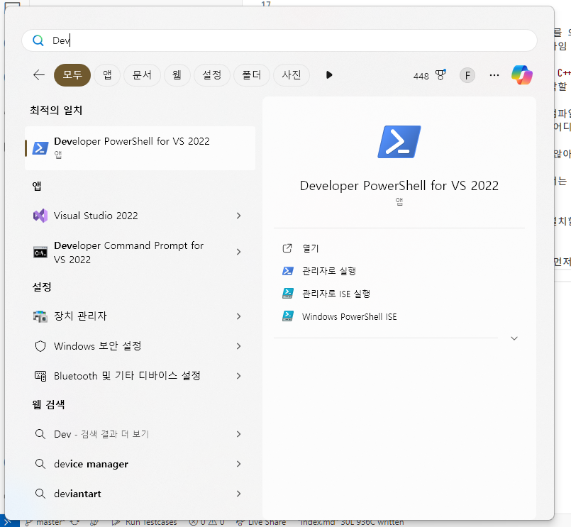

2022는 비주얼 스튜디오의 버전으로 설치된 비주얼 스튜디오의 버전에 따라서 달라진다.  

이를 실행하면 아래와 같은 터미널이 하나 뜨는데 여기에선 `cl`을 C/C++ 컴파일러로 사용할 수 있다.  
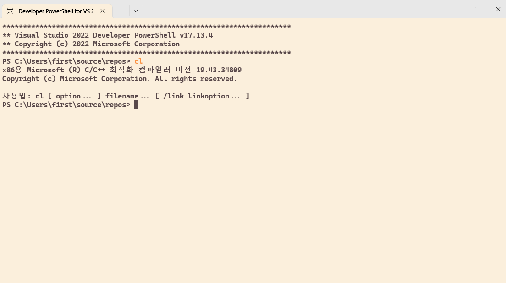

정상적으로 C 코드를 컴파일 및 실행할 수 있다.  
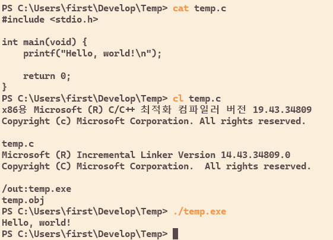

그러나 한 가지 사?소한 문제점이 있는데, 보통 이 Developer PowerShell이라는 물건은 구버전의 파워셀을 사용해 `&&` 같은 간단한 문법도 지원하지 않는다.  
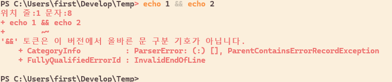

이 밖에도 구버전의 파워셸에서 오는 여러 불편함이 있고 무엇보다 주로 사용하는 환경이 아니므로 기존에 쓰던 터미널과 다른 환경이라는 문제점이 있다.  

## 환경 변수 설정하기
Developer PowerShell이 아닌 환경에서 `cl`을 실행하려고 하면 아래처럼 알 수 없는 명령이라고 에러가 난다.  
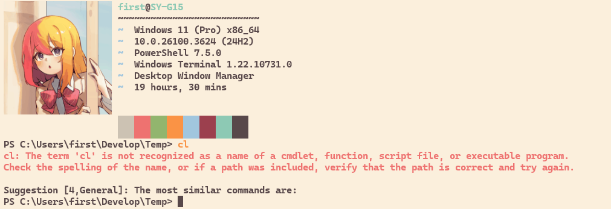

이를 해결하기 위해 다시 Developer PowerShell로 돌아와서,
```pwsh
Get-Command cl
```
을 쳐보면,
```pwsh
CommandType     Name                                               Version    Source
-----------     ----                                               -------    ------
Application     cl.exe                                             14.43.3... C:\Program Files\Microsoft Visual Stud...
```
같은 게 나올 것이다.  

여기서 `Source`가 `cl`이 위치한 곳인데 뒤에 `...`이 붙은 것은 단순히 경로가 길어서 줄인 것으로 창을 키우고 다시 `Get-Command`를 해보면 정상적으로 출력된다.  

```
C:\Program Files\Microsoft Visual Studio\2022\Community\VC\Tools\MSVC\14.43.34808\bin\HostX86\x86\cl.exe
```
전체 경로는 위와 비슷하게 생겼을 것이고 `2022`나 `14.43.34808` 같은 수들은 설치된 VS 버전에 따라서 달라질 수 있다.  

여기서 `cl.exe`를 제외한 경로를 환경 변수 PATH에 추가해주면 터미널에서 `cl`을 실행할 수 있다.  
```
C:\Program Files\Microsoft Visual Studio\2022\Community\VC\Tools\MSVC\14.43.34808\bin\HostX86\x86
```

이때 자신이 32비트 윈도우를 사용한다면 위 경로에서처럼 `HostX86\x86`을 그대로 사용하면 되고 64비트라면 `HostX64\x64`로 바꾸어주면 된다.  

### 환경 변수 편집
> #### 윈도우 키를 눌러 path 검색  
> 
>
> #### 환경 변수 클릭
> 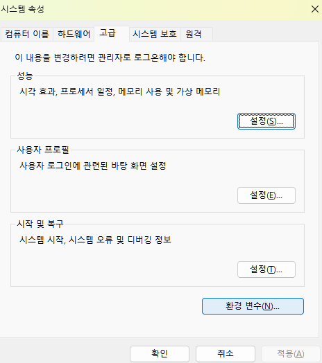
>
> #### PATH 더블 클릭
> 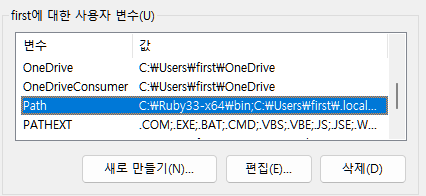
>
> #### `새로 만들기` 후 아까 봤던 경로 붙여넣기
> 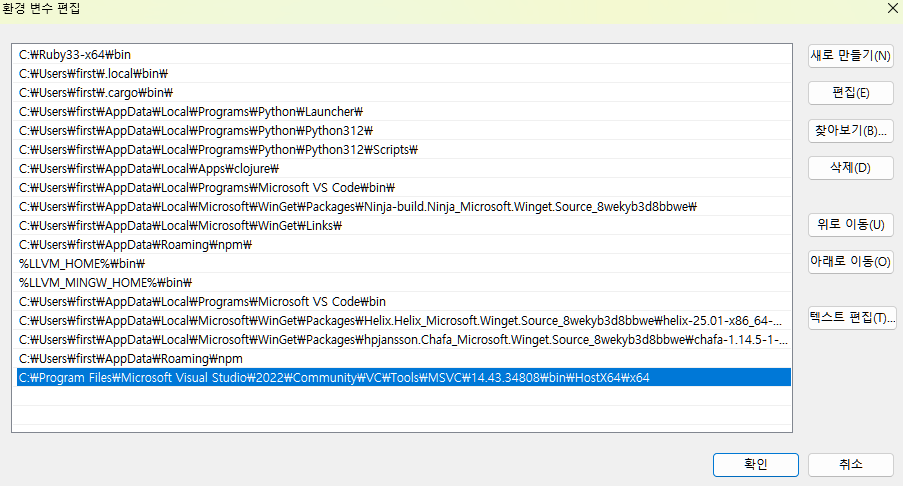


이렇게 하면 이제 Developer PowerShell이 아닌 환경에서 `cl`을 사용할 수 있다.  
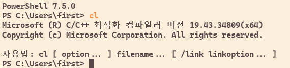

그러나 이를 실제로 사용하려고 하면 포함 경로 오류가 난다.  
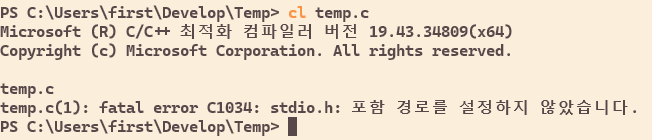  
이는 `cl` 그 자체로는 컴파일러이므로 이를 실제로 실행하기 위한 추가 환경 설정이 필요하기 때문이다.  

포함 경로를 해결하기 위해서 다시 Developer PowerShell로 돌아가,
```pwsh
> echo $env:INCLUDE
```
를 실행해보면,
```
C:\Program Files\Microsoft Visual Studio\2022\Community\VC\Tools\MSVC\14.43.34808\include;C:\Program Files\Microsoft Visual Studio\2022\Community\VC\Tools\MSVC\14.43.34808\ATLMFC\include;C:\Program Files\Microsoft Visual Studio\2022\Community\VC\Auxiliary\VS\include;C:\Program Files (x86)\Windows Kits\10\include\10.0.22000.0\ucrt;C:\Program Files (x86)\Windows Kits\10\\include\10.0.22000.0\\um;C:\Program Files (x86)\Windows Kits\10\\include\10.0.22000.0\\shared;C:\Program Files (x86)\Windows Kits\10\\include\10.0.22000.0\\winrt;C:\Program Files (x86)\Windows Kits\10\\include\10.0.22000.0\\cppwinrt
```
같은 게 나온다.  
이 역시 VS 버전에 따라서 달라질 수 있음에 유의한다.  

이제 이를 환경 변수에 추가해주면 된다.  
다만 아까와 달리 PATH에 추가하는 게 아니라 INCLUDE 변수를 새로 만들어줘야 한다.  

### 환경 변수 추가
> #### 사용자 변수 새로 만들기
> 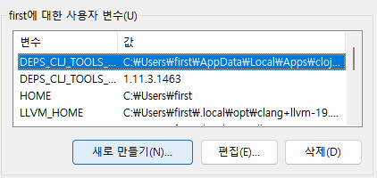
>
> #### INCLUDE 변수 추가
> 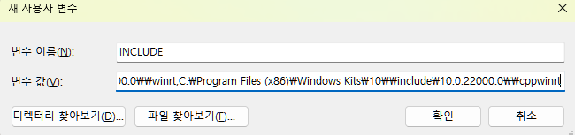  
> 아까 나왔던 그 긴 경로를 그대로 복사해 붙여넣으면 된다.  

이렇게 포함 경로 문제를 해결했다.  
하지만 마지막 문제가 남았으니 라이브러리를 불러올 수 없는 문제이다.  

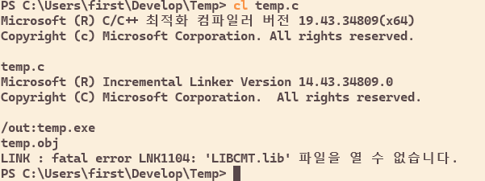

상술한 것처럼 `cl` 자체로는 컴파일러에 불과하므로 이를 실행할 때 필요한 라이브러리 또한 설정해줘야 한다.  

이번에는 Developer PowerShell에서,
```pwsh
> echo $env:LIB
```
를 실행해보면,
```
C:\Program Files\Microsoft Visual Studio\2022\Community\VC\Tools\MSVC\14.43.34808\ATLMFC\lib\x86;C:\Program Files\Microsoft Visual Studio\2022\Community\VC\Tools\MSVC\14.43.34808\lib\x86;C:\Program Files (x86)\Windows Kits\10\lib\10.0.22000.0\ucrt\x86;C:\Program Files (x86)\Windows Kits\10\\lib\10.0.22000.0\\um\x86
```
같은 것을 출력해준다.  

이를 아까 `INCLUDE` 환경 변수를 만들어준 것처럼 `LIB` 변수를 만들어주면 된다.  
이때 주의할 점은 아까 `cl`를 환경 변수에 추가했을 때처럼 자신이 32비트 윈도우를 사용 중이라면 `x86`을 쓰고 64비트라면 `x64`를 써야 한다.  

이렇게 하면 터미널에서 MSVC 환경을 사용하는 MSVC 컴파일러 또는 `cl`을 사용할 수 있게 된다.  
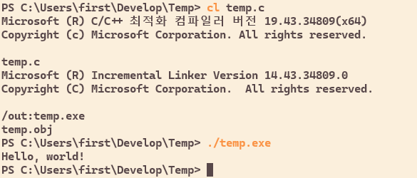

## 덧
위에서 살펴본 것처럼 MSVC는 마이크로소프트에서 만든 C/C++ 개발 환경의 통칭이고 이를 사용하는 컴파일러가 `cl`이다.  

그렇다면 다음과 같은 의문이 생길 수 있다.  
> MSVC가 그 자체로는 컴파일러가 아니라 환경이라면 이 환경에서 gcc나 clang을 사용할 수 있지 않을까?  

실제로 gcc, clang, cl 이 세 컴파일러는 그저 컴파일러이므로 컴파일러에서 지원한다면 MSVC를 사용할 수 있다.  

단, gcc는 MSVC와 함께 사용할 수 없고 윈도우에서 gcc를 사용하려면 MSVC의 역할을 해주는 MinGW나 MSYS 등을 별도로 설치해줘야 한다.  

그 말인 즉슨 별도의 환경 설정 없이 clang을 MSVC와 함께 윈도우에서 사용이 가능하다.  
[여기](https://github.com/llvm/llvm-project)에서 사용하는 OS에 맞는 릴리즈 버전을 다운로드한 후 앞서 `cl`을 환경 변수에 등록한 것처럼 실행 파일 경로를 PATH에 등록해주면 바로 사용할 수 있다.  
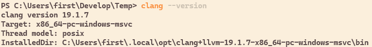

clang을 MSVC와 함께 사용하면 악명 높은 `scanf_s`와 `_CRT_SECURE_NO_WARNINGS` 관련 경고를 볼 수 있다.  
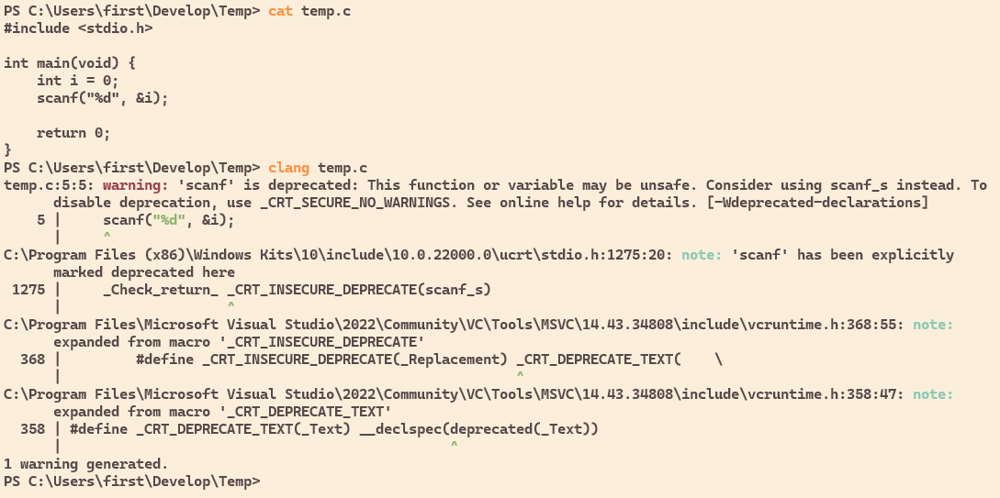